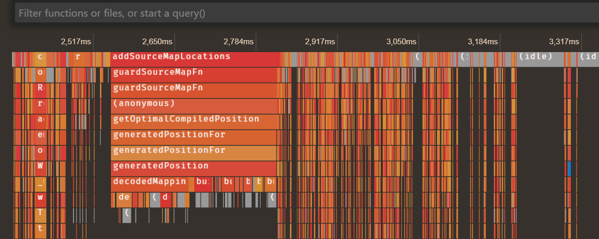

<h1>
  
   
  
</h1>

The new, upcoming JavaScript debugger for VS Code. This extension debugs Node.js and web applications (in Edge and Chrome), and will eventually become the built-in debugger for VS Code.

This extension is installed by default on all VS Code versions after 1.46.0, however it's not enabled. You can enable it by adding `"debug.javascript.usePreview": true` to your user settings. Then you should be able to run and debug your existing programs without changing your launch config. If you can't, then please file an issue.

### Nightly Extension

The shipped version of VS Code includes the js-debug version at the time of its release, however you may want to install our nightly build to get the latest fixes and features. To do this:

1. Open the extensions view (ctrl+shift+x) and search for `@builtin @id:ms-vscode.js-debug`
2. Right click on the `JavaScript Debugger` extension and `Disable` it.
3. Search for `@id:ms-vscode.js-debug-nightly` in the extensions view.
4. Install that extension.

## What's new?

In `js-debug` we aim to provide rich debugging for modern applications, with no or minimal configuration required. Here are a few new features that js-debug brings:

### Debug child process and workers

In Node.js, child processes will automatically be debugged. In browsers, service workers, webworkers, and iframes will be debugged as well.

While debugging workers, you can also step through `postMessage()` calls.

### Debug Node.js processes in the terminal

You can debug any Node.js process you run in the terminal with our revamped Auto Attach. If auto attach isn't on, you can run the command `Debug: Toggle Auto Attach` to turn it on. Next time you run a command like `npm start`, we'll debug it.

Once enabled, you can toggle Auto Attach by clicking the `Auto Attach: On/Off` button in the status bar on the bottom of your screen.

You can also create a one-off terminal for debugging via the `Debug: Create JavaScript Debug Terminal` command.

In the previous debugger, you had to remember to add the `--inspect` flag when you ran a command, and couldn't hit breakpoints early in the program since attachment was asynchronous.

### Profiling Support

You can capture and view performance profiles natively in VS Code, by clicking on the ⚪ button in the Call Stack view, or through the `Debug: Take Performance Profile` command. The profile information collected through VS Code is sourcemap-aware.

### Easy npm script debugging

You can debug npm scripts by clicking the code lens shown in the package.json, or by running the `Debug: Debug NPM Script` command/

You can configure where and if the code lens is displayed in the `debug.javascript.codelens.npmScripts` setting.

### Automatic browser debugging

By default, any links you click through the JavaScript debug terminal (`Debug: Create JavaScript Debug Terminal` command) will open in debug mode. If you'd like, you can enable this for all terminals, or disable it, by setting `debug.javascript.debugByLinkOptions` to `always` or `off`, respectively.

### Instrumentation breakpoints

When debugging web apps, you can configure instrumentation breakpoints from VS Code in the "Browser Breakpoints" view.

### Better autocompletion in debug console

Autocomplete in the debug console has been significantly improved. You can expect better suggestions for more complex expressions than VS Code was able to handle before.

### Return value interception

On a function's return statement, you can use, inspect, and modify the `$returnValue`.

Note that you can use and modify properties on the `$returnValue`, but not assign it to--it is effectively a `const` variable.

### Top-Level `await`

You can use `await` at the top level in the debug console.

However, like the Chrome devtools, if you use `await` while paused on a breakpoint, you'll only get a pending `Promise` back. This is because the JavaScript event loop is paused while on a breakpoint.

### Pretty-print minified sources

The debugger can now pretty print files, especially useful when dealing with minified sources. It will show a prompt when you step into or open a file that looks minified, and you can also trigger pretty printing manually via the `Debug: Pretty print for debugging` command.

[Click to view gif](https://code.visualstudio.com/assets/updates/1_43/js-debug-pretty-printing.gif)

You can turn off the suggestion prompt by selecting Never, or changing the setting debug.javascript.suggestPrettyPrinting to false.

### Support for Microsoft Edge and WebView2

We support launching the [new Microsoft Edge browser](https://www.microsoft.com/edge), via the `pwa-msedge` debug type. It supports all the same configuration settings as `chrome` does.

With this comes support for the [WebView2](https://docs.microsoft.com/microsoft-edge/hosting/webview2) control in desktop Windows applications. Check out our [webview demo](https://github.com/microsoft/vscode-js-debug/tree/master/demos/webview) to learn how to set this up.

### Better sourcemap and breakpoint behavior

Js-debug has a rewritten suite of sourcemap handling and breakpoint resolution logic. This results in more reliable breakpoint behavior in more cases. For example:

- We are guaranteed to set breakpoints before hitting them, where there were previously scenarios where this did not happen.
- We can handle sources present in multiple compiled files. This is common when dealing with split bundles in web apps.
- We now support in-place transpilation (such as `ts-node` and `@babel/register`).

### Copy values in call stack view

VS Code has long had an action to "Copy Value" from the Variables view. However, previously this was truncated for object or long values. Changes in VS Code and js-debug allow us to losslessly copy the full expressions as JSON.

### Other small things

js-debug is a cleanroom rewrite of a JavaScript debugger, so there are a large number of small improvements. Here are some more that are unworthy of their own heading:

- Console output is now improved. Promises, ArrayViews/ArrayBuffers, and other complex data structures are better supported.
- Logpoint breakpoints now support complex expressions and statements. Errors thrown will be printed, rather than silently eaten.
- You can now specify partial versions in the Node.js `runtimeVersion`. Previously you needed to specify the full version, such as `12.3.4`. Now, you can specify `12` and we'll use the most recent `12.*` installed on the system.
- Sourcemaps are now supported when attaching via the `Attach to Node.js Process` command.
- Several improvements have been made for faster performance and better out-of-the-box behavior in monorepos and multi-part applications.
- The `console.group()` set of APIs are now supported.
- You can pass `stable`, `canary`, or `dev` as `runtimeExecutable`s when launching browsers. We'll do our best to discover and use the specified version on your machine.
- You can now set the Node.js `program` to files with other or no extensions without workarounds.
- Restart frame requests are now supported.
- Command line APIs like `inpect()` and `copy()` are now available.

## Options

The following options can be configured:

- When creating your `launch.json`
- In the setting `debug.javascript.debugByLinkOptions` to configure defaults when control+clicking links in the debug terminal (the `pwa-chrome: launch` type)
- In the setting `debug.javascript.pickAndAttachOptions` to configure defaults when using the "Attach to Node.js Process" command (the `pwa-node: attach` type)
- In the setting `debug.javascript.terminalOptions` to configure defaults in the debug terminal (the `pwa-node-terminal: launch` type)

> This section is a work in process; documentation on some options needs further clarification

<!-- option start marker, used by build steps, do not modify -->

### pwa-node: attach

<h4>address</h4>
TCP/IP address of process to be debugged. Default is &#39;localhost&#39;.

<h5>Default value:</h4><pre><code>"localhost"</pre></code><h4>attachExistingChildren</h4>
Whether to attempt to attach to already-spawned child processes.

<h5>Default value:</h4><pre><code>true</pre></code><h4>autoAttachChildProcesses</h4>
Attach debugger to new child processes automatically.

<h5>Default value:</h4><pre><code>true</pre></code><h4>continueOnAttach</h4>
If true, we&#39;ll automatically resume programs launched and waiting on <code>--inspect-brk</code>

<h5>Default value:</h4><pre><code>false</pre></code><h4>cwd</h4>
Absolute path to the working directory of the program being debugged.

<h5>Default value:</h4><pre><code>"${workspaceFolder}"</pre></code><h4>env</h4>
Environment variables passed to the program. The value <code>null</code> removes the variable from the environment.

<h5>Default value:</h4><pre><code>{}</pre></code><h4>envFile</h4>
Absolute path to a file containing environment variable definitions.

<h5>Default value:</h4><pre><code>null</pre></code><h4>localRoot</h4>
Path to the local directory containing the program.

<h5>Default value:</h4><pre><code>null</pre></code><h4>outFiles</h4>
If source maps are enabled, these glob patterns specify the generated JavaScript files. If a pattern starts with <code>!</code> the files are excluded. If not specified, the generated code is expected in the same directory as its source.

<h5>Default value:</h4><pre><code>[
  "${workspaceFolder}/**/*.js",
  "!**/node_modules/**"
]</pre></code><h4>outputCapture</h4>
From where to capture output messages: the default debug API if set to <code>console</code>, or stdout/stderr streams if set to <code>std</code>.

<h5>Default value:</h4><pre><code>"console"</pre></code><h4>pauseForSourceMap</h4>
Whether to wait for source maps to load for each incoming script. This has a performance overhead, and might be safely disabled when running off of disk, so long as <code>rootPath</code> is not disabled.

<h5>Default value:</h4><pre><code>false</pre></code><h4>port</h4>
Debug port to attach to. Default is 5858.

<h5>Default value:</h4><pre><code>9229</pre></code><h4>processId</h4>
ID of process to attach to.

<h5>Default value:</h4><pre><code>undefined</pre></code><h4>remoteRoot</h4>
Absolute path to the remote directory containing the program.

<h5>Default value:</h4><pre><code>null</pre></code><h4>resolveSourceMapLocations</h4>
A list of minimatch patterns for locations (folders and URLs) in which source maps can be used to resolve local files. This can be used to avoid incorrectly breaking in external source mapped code. Patterns can be prefixed with &quot;!&quot; to exclude them. May be set to an empty array or null to avoid restriction.

<h5>Default value:</h4><pre><code>null</pre></code><h4>restart</h4>
Try to reconnect to the program if we lose connection. If set to <code>true</code>, we&#39;ll try once a second, forever. You can customize the interval and maximum number of attempts by specifying the <code>delay</code> and <code>maxAttempts</code> in an object instead.

<h5>Default value:</h4><pre><code>false</pre></code><h4>runtimeSourcemapPausePatterns</h4>
A list of patterns at which to manually insert entrypoint breakpoints. This can be useful to give the debugger an opportunity to set breakpoints when using sourcemaps that don&#39;t exist or can&#39;t be detected before launch, such as <a href="https://github.com/microsoft/vscode-js-debug/issues/492">with the Serverless framework</a>.

<h5>Default value:</h4><pre><code>[]</pre></code><h4>showAsyncStacks</h4>
Show the async calls that led to the current call stack.

<h5>Default value:</h4><pre><code>true</pre></code><h4>skipFiles</h4>
An array of file or folder names, or path globs, to skip when debugging.

<h5>Default value:</h4><pre><code>[]</pre></code><h4>smartStep</h4>
Automatically step through generated code that cannot be mapped back to the original source.

<h5>Default value:</h4><pre><code>true</pre></code><h4>sourceMapPathOverrides</h4>
A set of mappings for rewriting the locations of source files from what the sourcemap says, to their locations on disk.

<h5>Default value:</h4><pre><code>{
  "webpack://?:*/*": "${workspaceFolder}/*",
  "webpack:///./~/*": "${workspaceFolder}/node_modules/*",
  "meteor://💻app/*": "${workspaceFolder}/*"
}</pre></code><h4>sourceMaps</h4>
Use JavaScript source maps (if they exist).

<h5>Default value:</h4><pre><code>true</pre></code><h4>timeout</h4>
Retry for this number of milliseconds to connect to Node.js. Default is 10000 ms.

<h5>Default value:</h4><pre><code>10000</pre></code><h4>trace</h4>
Configures what diagnostic output is produced.

<h5>Default value:</h4><pre><code>false</pre></code>

### pwa-node: launch

<h4>args</h4>
Command line arguments passed to the program.

<h5>Default value:</h4><pre><code>[]</pre></code><h4>autoAttachChildProcesses</h4>
Attach debugger to new child processes automatically.

<h5>Default value:</h4><pre><code>true</pre></code><h4>console</h4>
Where to launch the debug target.

<h5>Default value:</h4><pre><code>"internalConsole"</pre></code><h4>cwd</h4>
Absolute path to the working directory of the program being debugged.

<h5>Default value:</h4><pre><code>"${workspaceFolder}"</pre></code><h4>env</h4>
Environment variables passed to the program. The value <code>null</code> removes the variable from the environment.

<h5>Default value:</h4><pre><code>{}</pre></code><h4>envFile</h4>
Absolute path to a file containing environment variable definitions.

<h5>Default value:</h4><pre><code>null</pre></code><h4>localRoot</h4>
Path to the local directory containing the program.

<h5>Default value:</h4><pre><code>null</pre></code><h4>outFiles</h4>
If source maps are enabled, these glob patterns specify the generated JavaScript files. If a pattern starts with <code>!</code> the files are excluded. If not specified, the generated code is expected in the same directory as its source.

<h5>Default value:</h4><pre><code>[
  "${workspaceFolder}/**/*.js",
  "!**/node_modules/**"
]</pre></code><h4>outputCapture</h4>
From where to capture output messages: the default debug API if set to <code>console</code>, or stdout/stderr streams if set to <code>std</code>.

<h5>Default value:</h4><pre><code>"console"</pre></code><h4>pauseForSourceMap</h4>
Whether to wait for source maps to load for each incoming script. This has a performance overhead, and might be safely disabled when running off of disk, so long as <code>rootPath</code> is not disabled.

<h5>Default value:</h4><pre><code>false</pre></code><h4>profileStartup</h4>
If true, will start profiling soon as the process launches

<h5>Default value:</h4><pre><code>false</pre></code><h4>program</h4>
Absolute path to the program. Generated value is guessed by looking at package.json and opened files. Edit this attribute.

<h5>Default value:</h4><pre><code>""</pre></code><h4>remoteRoot</h4>
Absolute path to the remote directory containing the program.

<h5>Default value:</h4><pre><code>null</pre></code><h4>resolveSourceMapLocations</h4>
A list of minimatch patterns for locations (folders and URLs) in which source maps can be used to resolve local files. This can be used to avoid incorrectly breaking in external source mapped code. Patterns can be prefixed with &quot;!&quot; to exclude them. May be set to an empty array or null to avoid restriction.

<h5>Default value:</h4><pre><code>null</pre></code><h4>restart</h4>
Try to reconnect to the program if we lose connection. If set to <code>true</code>, we&#39;ll try once a second, forever. You can customize the interval and maximum number of attempts by specifying the <code>delay</code> and <code>maxAttempts</code> in an object instead.

<h5>Default value:</h4><pre><code>false</pre></code><h4>runtimeArgs</h4>
Optional arguments passed to the runtime executable.

<h5>Default value:</h4><pre><code>[]</pre></code><h4>runtimeExecutable</h4>
Runtime to use. Either an absolute path or the name of a runtime available on the PATH. If omitted <code>node</code> is assumed.

<h5>Default value:</h4><pre><code>"node"</pre></code><h4>runtimeSourcemapPausePatterns</h4>
A list of patterns at which to manually insert entrypoint breakpoints. This can be useful to give the debugger an opportunity to set breakpoints when using sourcemaps that don&#39;t exist or can&#39;t be detected before launch, such as <a href="https://github.com/microsoft/vscode-js-debug/issues/492">with the Serverless framework</a>.

<h5>Default value:</h4><pre><code>[]</pre></code><h4>runtimeVersion</h4>
Version of <code>node</code> runtime to use. Requires <code>nvm</code>.

<h5>Default value:</h4><pre><code>"default"</pre></code><h4>showAsyncStacks</h4>
Show the async calls that led to the current call stack.

<h5>Default value:</h4><pre><code>true</pre></code><h4>skipFiles</h4>
An array of file or folder names, or path globs, to skip when debugging.

<h5>Default value:</h4><pre><code>[]</pre></code><h4>smartStep</h4>
Automatically step through generated code that cannot be mapped back to the original source.

<h5>Default value:</h4><pre><code>true</pre></code><h4>sourceMapPathOverrides</h4>
A set of mappings for rewriting the locations of source files from what the sourcemap says, to their locations on disk.

<h5>Default value:</h4><pre><code>{
  "webpack://?:*/*": "${workspaceFolder}/*",
  "webpack:///./~/*": "${workspaceFolder}/node_modules/*",
  "meteor://💻app/*": "${workspaceFolder}/*"
}</pre></code><h4>sourceMaps</h4>
Use JavaScript source maps (if they exist).

<h5>Default value:</h4><pre><code>true</pre></code><h4>stopOnEntry</h4>
Automatically stop program after launch.

<h5>Default value:</h4><pre><code>false</pre></code><h4>timeout</h4>
Retry for this number of milliseconds to connect to Node.js. Default is 10000 ms.

<h5>Default value:</h4><pre><code>10000</pre></code><h4>trace</h4>
Configures what diagnostic output is produced.

<h5>Default value:</h4><pre><code>false</pre></code>

### node-terminal: launch

<h4>autoAttachChildProcesses</h4>
Attach debugger to new child processes automatically.

<h5>Default value:</h4><pre><code>true</pre></code><h4>command</h4>
Command to run in the launched terminal. If not provided, the terminal will open without launching a program.

<h5>Default value:</h4><pre><code>undefined</pre></code><h4>cwd</h4>
Absolute path to the working directory of the program being debugged.

<h5>Default value:</h4><pre><code>"${workspaceFolder}"</pre></code><h4>env</h4>
Environment variables passed to the program. The value <code>null</code> removes the variable from the environment.

<h5>Default value:</h4><pre><code>{}</pre></code><h4>envFile</h4>
Absolute path to a file containing environment variable definitions.

<h5>Default value:</h4><pre><code>null</pre></code><h4>localRoot</h4>
Path to the local directory containing the program.

<h5>Default value:</h4><pre><code>null</pre></code><h4>outFiles</h4>
If source maps are enabled, these glob patterns specify the generated JavaScript files. If a pattern starts with <code>!</code> the files are excluded. If not specified, the generated code is expected in the same directory as its source.

<h5>Default value:</h4><pre><code>[
  "${workspaceFolder}/**/*.js",
  "!**/node_modules/**"
]</pre></code><h4>outputCapture</h4>
From where to capture output messages: the default debug API if set to <code>console</code>, or stdout/stderr streams if set to <code>std</code>.

<h5>Default value:</h4><pre><code>"console"</pre></code><h4>pauseForSourceMap</h4>
Whether to wait for source maps to load for each incoming script. This has a performance overhead, and might be safely disabled when running off of disk, so long as <code>rootPath</code> is not disabled.

<h5>Default value:</h4><pre><code>false</pre></code><h4>remoteRoot</h4>
Absolute path to the remote directory containing the program.

<h5>Default value:</h4><pre><code>null</pre></code><h4>resolveSourceMapLocations</h4>
A list of minimatch patterns for locations (folders and URLs) in which source maps can be used to resolve local files. This can be used to avoid incorrectly breaking in external source mapped code. Patterns can be prefixed with &quot;!&quot; to exclude them. May be set to an empty array or null to avoid restriction.

<h5>Default value:</h4><pre><code>null</pre></code><h4>runtimeSourcemapPausePatterns</h4>
A list of patterns at which to manually insert entrypoint breakpoints. This can be useful to give the debugger an opportunity to set breakpoints when using sourcemaps that don&#39;t exist or can&#39;t be detected before launch, such as <a href="https://github.com/microsoft/vscode-js-debug/issues/492">with the Serverless framework</a>.

<h5>Default value:</h4><pre><code>[]</pre></code><h4>showAsyncStacks</h4>
Show the async calls that led to the current call stack.

<h5>Default value:</h4><pre><code>{
  "onceBreakpointResolved": 16
}</pre></code><h4>skipFiles</h4>
An array of file or folder names, or path globs, to skip when debugging.

<h5>Default value:</h4><pre><code>[]</pre></code><h4>smartStep</h4>
Automatically step through generated code that cannot be mapped back to the original source.

<h5>Default value:</h4><pre><code>true</pre></code><h4>sourceMapPathOverrides</h4>
A set of mappings for rewriting the locations of source files from what the sourcemap says, to their locations on disk.

<h5>Default value:</h4><pre><code>{
  "webpack://?:*/*": "${workspaceFolder}/*",
  "webpack:///./~/*": "${workspaceFolder}/node_modules/*",
  "meteor://💻app/*": "${workspaceFolder}/*"
}</pre></code><h4>sourceMaps</h4>
Use JavaScript source maps (if they exist).

<h5>Default value:</h4><pre><code>true</pre></code><h4>timeout</h4>
Retry for this number of milliseconds to connect to Node.js. Default is 10000 ms.

<h5>Default value:</h4><pre><code>10000</pre></code><h4>trace</h4>
Configures what diagnostic output is produced.

<h5>Default value:</h4><pre><code>false</pre></code>

### pwa-extensionHost: launch

<h4>args</h4>
Command line arguments passed to the program.

<h5>Default value:</h4><pre><code>[
  "--extensionDevelopmentPath=${workspaceFolder}"
]</pre></code><h4>autoAttachChildProcesses</h4>
Attach debugger to new child processes automatically.

<h5>Default value:</h4><pre><code>false</pre></code><h4>cwd</h4>
Absolute path to the working directory of the program being debugged.

<h5>Default value:</h4><pre><code>"${workspaceFolder}"</pre></code><h4>debugWebviews</h4>
Configures whether we should try to attach to webviews in the launched VS Code instance. <strong>Note:</strong> at the moment this requires the setting <code>&quot;webview.experimental.useExternalEndpoint&quot;: true</code> to work properly, and will only work in desktop VS Code.

<h5>Default value:</h4><pre><code>false</pre></code><h4>env</h4>
Environment variables passed to the program. The value <code>null</code> removes the variable from the environment.

<h5>Default value:</h4><pre><code>{}</pre></code><h4>envFile</h4>
Absolute path to a file containing environment variable definitions.

<h5>Default value:</h4><pre><code>null</pre></code><h4>localRoot</h4>
Path to the local directory containing the program.

<h5>Default value:</h4><pre><code>null</pre></code><h4>outFiles</h4>
If source maps are enabled, these glob patterns specify the generated JavaScript files. If a pattern starts with <code>!</code> the files are excluded. If not specified, the generated code is expected in the same directory as its source.

<h5>Default value:</h4><pre><code>[
  "${workspaceFolder}/out/**/*.js"
]</pre></code><h4>outputCapture</h4>
From where to capture output messages: the default debug API if set to <code>console</code>, or stdout/stderr streams if set to <code>std</code>.

<h5>Default value:</h4><pre><code>"console"</pre></code><h4>pauseForSourceMap</h4>
Whether to wait for source maps to load for each incoming script. This has a performance overhead, and might be safely disabled when running off of disk, so long as <code>rootPath</code> is not disabled.

<h5>Default value:</h4><pre><code>false</pre></code><h4>remoteRoot</h4>
Absolute path to the remote directory containing the program.

<h5>Default value:</h4><pre><code>null</pre></code><h4>resolveSourceMapLocations</h4>
A list of minimatch patterns for locations (folders and URLs) in which source maps can be used to resolve local files. This can be used to avoid incorrectly breaking in external source mapped code. Patterns can be prefixed with &quot;!&quot; to exclude them. May be set to an empty array or null to avoid restriction.

<h5>Default value:</h4><pre><code>[
  "${workspaceFolder}/**",
  "!**/node_modules/**"
]</pre></code><h4>runtimeExecutable</h4>
Absolute path to VS Code.

<h5>Default value:</h4><pre><code>"${execPath}"</pre></code><h4>runtimeSourcemapPausePatterns</h4>
A list of patterns at which to manually insert entrypoint breakpoints. This can be useful to give the debugger an opportunity to set breakpoints when using sourcemaps that don&#39;t exist or can&#39;t be detected before launch, such as <a href="https://github.com/microsoft/vscode-js-debug/issues/492">with the Serverless framework</a>.

<h5>Default value:</h4><pre><code>[]</pre></code><h4>showAsyncStacks</h4>
Show the async calls that led to the current call stack.

<h5>Default value:</h4><pre><code>true</pre></code><h4>skipFiles</h4>
An array of file or folder names, or path globs, to skip when debugging.

<h5>Default value:</h4><pre><code>[]</pre></code><h4>smartStep</h4>
Automatically step through generated code that cannot be mapped back to the original source.

<h5>Default value:</h4><pre><code>true</pre></code><h4>sourceMapPathOverrides</h4>
A set of mappings for rewriting the locations of source files from what the sourcemap says, to their locations on disk.

<h5>Default value:</h4><pre><code>{
  "webpack://?:*/*": "${workspaceFolder}/*",
  "webpack:///./~/*": "${workspaceFolder}/node_modules/*",
  "meteor://💻app/*": "${workspaceFolder}/*"
}</pre></code><h4>sourceMaps</h4>
Use JavaScript source maps (if they exist).

<h5>Default value:</h4><pre><code>true</pre></code><h4>timeout</h4>
Retry for this number of milliseconds to connect to Node.js. Default is 10000 ms.

<h5>Default value:</h4><pre><code>10000</pre></code><h4>trace</h4>
Configures what diagnostic output is produced.

<h5>Default value:</h4><pre><code>false</pre></code>

### pwa-chrome: launch

<h4>browserLaunchLocation</h4>
Forces the browser to be launched in one location. In a remote workspace (through ssh or WSL, for example) this can be used to open the browser on the remote machine rather than locally.

<h5>Default value:</h4><pre><code>"workspace"</pre></code><h4>cleanUp</h4>
What clean-up to do after the debugging session finishes. Close only the tab being debug, vs. close the whole browser.

<h5>Default value:</h4><pre><code>"onlyTab"</pre></code><h4>cwd</h4>
Optional working directory for the runtime executable.

<h5>Default value:</h4><pre><code>null</pre></code><h4>disableNetworkCache</h4>
Controls whether to skip the network cache for each request

<h5>Default value:</h4><pre><code>true</pre></code><h4>env</h4>
Optional dictionary of environment key/value pairs for the browser.

<h5>Default value:</h4><pre><code>{}</pre></code><h4>file</h4>
A local html file to open in the browser

<h5>Default value:</h4><pre><code>null</pre></code><h4>includeDefaultArgs</h4>
Whether default browser launch arguments (to disable features that may make debugging harder) will be included in the launch.

<h5>Default value:</h4><pre><code>true</pre></code><h4>inspectUri</h4>
Format to use to rewrite the inspectUri: It&#39;s a template string that interpolates keys in <code>{curlyBraces}</code>. Available keys are:  - <code>url.*</code> is the parsed address of the running application. For instance, <code>{url.port}</code>, <code>{url.hostname}</code>  - <code>port</code> is the debug port that Chrome is listening on.  - <code>browserInspectUri</code> is the inspector URI on the launched browser  - <code>wsProtocol</code> is the hinted websocket protocol. This is set to <code>wss</code> if the original URL is <code>https</code>, or <code>ws</code> otherwise. 

<h5>Default value:</h4><pre><code>undefined</pre></code><h4>outFiles</h4>
If source maps are enabled, these glob patterns specify the generated JavaScript files. If a pattern starts with <code>!</code> the files are excluded. If not specified, the generated code is expected in the same directory as its source.

<h5>Default value:</h4><pre><code>[
  "${workspaceFolder}/**/*.js",
  "!**/node_modules/**"
]</pre></code><h4>outputCapture</h4>
From where to capture output messages: the default debug API if set to <code>console</code>, or stdout/stderr streams if set to <code>std</code>.

<h5>Default value:</h4><pre><code>"console"</pre></code><h4>pathMapping</h4>
A mapping of URLs/paths to local folders, to resolve scripts in the Browser to scripts on disk

<h5>Default value:</h4><pre><code>{}</pre></code><h4>pauseForSourceMap</h4>
Whether to wait for source maps to load for each incoming script. This has a performance overhead, and might be safely disabled when running off of disk, so long as <code>rootPath</code> is not disabled.

<h5>Default value:</h4><pre><code>true</pre></code><h4>port</h4>
Port for the browser to listen on. Defaults to &quot;0&quot;, which will cause the browser to be debugged via pipes, which is generally more secure and should be chosen unless you need to attach to the browser from another tool.

<h5>Default value:</h4><pre><code>0</pre></code><h4>profileStartup</h4>
If true, will start profiling soon as the process launches

<h5>Default value:</h4><pre><code>false</pre></code><h4>resolveSourceMapLocations</h4>
A list of minimatch patterns for locations (folders and URLs) in which source maps can be used to resolve local files. This can be used to avoid incorrectly breaking in external source mapped code. Patterns can be prefixed with &quot;!&quot; to exclude them. May be set to an empty array or null to avoid restriction.

<h5>Default value:</h4><pre><code>null</pre></code><h4>runtimeArgs</h4>
Optional arguments passed to the runtime executable.

<h5>Default value:</h4><pre><code>null</pre></code><h4>runtimeExecutable</h4>
Either &#39;canary&#39;, &#39;stable&#39;, &#39;custom&#39; or path to the browser executable. Custom means a custom wrapper, custom build or CHROME_PATH environment variable.

<h5>Default value:</h4><pre><code>"stable"</pre></code><h4>showAsyncStacks</h4>
Show the async calls that led to the current call stack.

<h5>Default value:</h4><pre><code>true</pre></code><h4>skipFiles</h4>
An array of file or folder names, or path globs, to skip when debugging.

<h5>Default value:</h4><pre><code>[]</pre></code><h4>smartStep</h4>
Automatically step through generated code that cannot be mapped back to the original source.

<h5>Default value:</h4><pre><code>true</pre></code><h4>sourceMapPathOverrides</h4>
A set of mappings for rewriting the locations of source files from what the sourcemap says, to their locations on disk.

<h5>Default value:</h4><pre><code>{
  "webpack://?:*/*": "${webRoot}/*",
  "webpack:///./~/*": "${webRoot}/node_modules/*",
  "meteor://💻app/*": "${webRoot}/*"
}</pre></code><h4>sourceMaps</h4>
Use JavaScript source maps (if they exist).

<h5>Default value:</h4><pre><code>true</pre></code><h4>timeout</h4>
Retry for this number of milliseconds to connect to Node.js. Default is 10000 ms.

<h5>Default value:</h4><pre><code>10000</pre></code><h4>trace</h4>
Configures what diagnostic output is produced.

<h5>Default value:</h4><pre><code>false</pre></code><h4>url</h4>
Will search for a tab with this exact url and attach to it, if found

<h5>Default value:</h4><pre><code>null</pre></code><h4>urlFilter</h4>
Will search for a page with this url and attach to it, if found. Can have * wildcards.

<h5>Default value:</h4><pre><code>""</pre></code><h4>userDataDir</h4>
By default, the browser is launched with a separate user profile in a temp folder. Use this option to override it. Set to false to launch with your default user profile.

<h5>Default value:</h4><pre><code>true</pre></code><h4>vueComponentPaths</h4>
A list of file glob patterns to find <code>*.vue</code> components. By default, searches the entire workspace. This needs to be specified due to extra lookups that Vue&#39;s sourcemaps require in Vue CLI 4. You can disable this special handling by setting this to an empty array.

<h5>Default value:</h4><pre><code>[
  "${workspaceFolder}/**/*.vue",
  "!**/node_modules/**"
]</pre></code><h4>webRoot</h4>
This specifies the workspace absolute path to the webserver root. Used to resolve paths like <code>/app.js</code> to files on disk. Shorthand for a pathMapping for &quot;/&quot;

<h5>Default value:</h4><pre><code>"${workspaceFolder}"</pre></code>

### pwa-chrome: attach

<h4>address</h4>
IP address or hostname the debugged browser is listening on.

<h5>Default value:</h4><pre><code>"localhost"</pre></code><h4>disableNetworkCache</h4>
Controls whether to skip the network cache for each request

<h5>Default value:</h4><pre><code>true</pre></code><h4>inspectUri</h4>
Format to use to rewrite the inspectUri: It&#39;s a template string that interpolates keys in <code>{curlyBraces}</code>. Available keys are:  - <code>url.*</code> is the parsed address of the running application. For instance, <code>{url.port}</code>, <code>{url.hostname}</code>  - <code>port</code> is the debug port that Chrome is listening on.  - <code>browserInspectUri</code> is the inspector URI on the launched browser  - <code>wsProtocol</code> is the hinted websocket protocol. This is set to <code>wss</code> if the original URL is <code>https</code>, or <code>ws</code> otherwise. 

<h5>Default value:</h4><pre><code>undefined</pre></code><h4>outFiles</h4>
If source maps are enabled, these glob patterns specify the generated JavaScript files. If a pattern starts with <code>!</code> the files are excluded. If not specified, the generated code is expected in the same directory as its source.

<h5>Default value:</h4><pre><code>[
  "${workspaceFolder}/**/*.js",
  "!**/node_modules/**"
]</pre></code><h4>outputCapture</h4>
From where to capture output messages: the default debug API if set to <code>console</code>, or stdout/stderr streams if set to <code>std</code>.

<h5>Default value:</h4><pre><code>"console"</pre></code><h4>pathMapping</h4>
A mapping of URLs/paths to local folders, to resolve scripts in the Browser to scripts on disk

<h5>Default value:</h4><pre><code>{}</pre></code><h4>pauseForSourceMap</h4>
Whether to wait for source maps to load for each incoming script. This has a performance overhead, and might be safely disabled when running off of disk, so long as <code>rootPath</code> is not disabled.

<h5>Default value:</h4><pre><code>true</pre></code><h4>port</h4>
Port to use to remote debugging the browser, given as <code>--remote-debugging-port</code> when launching the browser.

<h5>Default value:</h4><pre><code>0</pre></code><h4>resolveSourceMapLocations</h4>
A list of minimatch patterns for locations (folders and URLs) in which source maps can be used to resolve local files. This can be used to avoid incorrectly breaking in external source mapped code. Patterns can be prefixed with &quot;!&quot; to exclude them. May be set to an empty array or null to avoid restriction.

<h5>Default value:</h4><pre><code>null</pre></code><h4>restart</h4>
Whether to reconnect if the browser connection is closed

<h5>Default value:</h4><pre><code>false</pre></code><h4>showAsyncStacks</h4>
Show the async calls that led to the current call stack.

<h5>Default value:</h4><pre><code>true</pre></code><h4>skipFiles</h4>
An array of file or folder names, or path globs, to skip when debugging.

<h5>Default value:</h4><pre><code>[]</pre></code><h4>smartStep</h4>
Automatically step through generated code that cannot be mapped back to the original source.

<h5>Default value:</h4><pre><code>true</pre></code><h4>sourceMapPathOverrides</h4>
A set of mappings for rewriting the locations of source files from what the sourcemap says, to their locations on disk.

<h5>Default value:</h4><pre><code>{
  "webpack://?:*/*": "${webRoot}/*",
  "webpack:///./~/*": "${webRoot}/node_modules/*",
  "meteor://💻app/*": "${webRoot}/*"
}</pre></code><h4>sourceMaps</h4>
Use JavaScript source maps (if they exist).

<h5>Default value:</h4><pre><code>true</pre></code><h4>targetSelection</h4>
Whether to attach to all targets that match the URL filter (&quot;automatic&quot;) or ask to pick one (&quot;pick&quot;).

<h5>Default value:</h4><pre><code>"automatic"</pre></code><h4>timeout</h4>
Retry for this number of milliseconds to connect to Node.js. Default is 10000 ms.

<h5>Default value:</h4><pre><code>10000</pre></code><h4>trace</h4>
Configures what diagnostic output is produced.

<h5>Default value:</h4><pre><code>false</pre></code><h4>url</h4>
Will search for a tab with this exact url and attach to it, if found

<h5>Default value:</h4><pre><code>null</pre></code><h4>urlFilter</h4>
Will search for a page with this url and attach to it, if found. Can have * wildcards.

<h5>Default value:</h4><pre><code>""</pre></code><h4>vueComponentPaths</h4>
A list of file glob patterns to find <code>*.vue</code> components. By default, searches the entire workspace. This needs to be specified due to extra lookups that Vue&#39;s sourcemaps require in Vue CLI 4. You can disable this special handling by setting this to an empty array.

<h5>Default value:</h4><pre><code>[
  "${workspaceFolder}/**/*.vue",
  "!**/node_modules/**"
]</pre></code><h4>webRoot</h4>
This specifies the workspace absolute path to the webserver root. Used to resolve paths like <code>/app.js</code> to files on disk. Shorthand for a pathMapping for &quot;/&quot;

<h5>Default value:</h4><pre><code>"${workspaceFolder}"</pre></code>

### pwa-msedge: launch

<h4>address</h4>
When debugging webviews, the IP address or hostname the webview is listening on. Will be automatically discovered if not set.

<h5>Default value:</h4><pre><code>"localhost"</pre></code><h4>browserLaunchLocation</h4>
Forces the browser to be launched in one location. In a remote workspace (through ssh or WSL, for example) this can be used to open the browser on the remote machine rather than locally.

<h5>Default value:</h4><pre><code>"workspace"</pre></code><h4>cleanUp</h4>
What clean-up to do after the debugging session finishes. Close only the tab being debug, vs. close the whole browser.

<h5>Default value:</h4><pre><code>"onlyTab"</pre></code><h4>cwd</h4>
Optional working directory for the runtime executable.

<h5>Default value:</h4><pre><code>null</pre></code><h4>disableNetworkCache</h4>
Controls whether to skip the network cache for each request

<h5>Default value:</h4><pre><code>true</pre></code><h4>env</h4>
Optional dictionary of environment key/value pairs for the browser.

<h5>Default value:</h4><pre><code>{}</pre></code><h4>file</h4>
A local html file to open in the browser

<h5>Default value:</h4><pre><code>null</pre></code><h4>includeDefaultArgs</h4>
Whether default browser launch arguments (to disable features that may make debugging harder) will be included in the launch.

<h5>Default value:</h4><pre><code>true</pre></code><h4>inspectUri</h4>
Format to use to rewrite the inspectUri: It&#39;s a template string that interpolates keys in <code>{curlyBraces}</code>. Available keys are:  - <code>url.*</code> is the parsed address of the running application. For instance, <code>{url.port}</code>, <code>{url.hostname}</code>  - <code>port</code> is the debug port that Chrome is listening on.  - <code>browserInspectUri</code> is the inspector URI on the launched browser  - <code>wsProtocol</code> is the hinted websocket protocol. This is set to <code>wss</code> if the original URL is <code>https</code>, or <code>ws</code> otherwise. 

<h5>Default value:</h4><pre><code>undefined</pre></code><h4>outFiles</h4>
If source maps are enabled, these glob patterns specify the generated JavaScript files. If a pattern starts with <code>!</code> the files are excluded. If not specified, the generated code is expected in the same directory as its source.

<h5>Default value:</h4><pre><code>[
  "${workspaceFolder}/**/*.js",
  "!**/node_modules/**"
]</pre></code><h4>outputCapture</h4>
From where to capture output messages: the default debug API if set to <code>console</code>, or stdout/stderr streams if set to <code>std</code>.

<h5>Default value:</h4><pre><code>"console"</pre></code><h4>pathMapping</h4>
A mapping of URLs/paths to local folders, to resolve scripts in the Browser to scripts on disk

<h5>Default value:</h4><pre><code>{}</pre></code><h4>pauseForSourceMap</h4>
Whether to wait for source maps to load for each incoming script. This has a performance overhead, and might be safely disabled when running off of disk, so long as <code>rootPath</code> is not disabled.

<h5>Default value:</h4><pre><code>true</pre></code><h4>port</h4>
When debugging webviews, the port the webview debugger is listening on. Will be automatically discovered if not set.

<h5>Default value:</h4><pre><code>0</pre></code><h4>profileStartup</h4>
If true, will start profiling soon as the process launches

<h5>Default value:</h4><pre><code>false</pre></code><h4>resolveSourceMapLocations</h4>
A list of minimatch patterns for locations (folders and URLs) in which source maps can be used to resolve local files. This can be used to avoid incorrectly breaking in external source mapped code. Patterns can be prefixed with &quot;!&quot; to exclude them. May be set to an empty array or null to avoid restriction.

<h5>Default value:</h4><pre><code>null</pre></code><h4>runtimeArgs</h4>
Optional arguments passed to the runtime executable.

<h5>Default value:</h4><pre><code>null</pre></code><h4>runtimeExecutable</h4>
Either &#39;canary&#39;, &#39;stable&#39;, &#39;dev&#39;, &#39;custom&#39; or path to the browser executable. Custom means a custom wrapper, custom build or EDGE_PATH environment variable.

<h5>Default value:</h4><pre><code>"stable"</pre></code><h4>showAsyncStacks</h4>
Show the async calls that led to the current call stack.

<h5>Default value:</h4><pre><code>true</pre></code><h4>skipFiles</h4>
An array of file or folder names, or path globs, to skip when debugging.

<h5>Default value:</h4><pre><code>[]</pre></code><h4>smartStep</h4>
Automatically step through generated code that cannot be mapped back to the original source.

<h5>Default value:</h4><pre><code>true</pre></code><h4>sourceMapPathOverrides</h4>
A set of mappings for rewriting the locations of source files from what the sourcemap says, to their locations on disk.

<h5>Default value:</h4><pre><code>{
  "webpack://?:*/*": "${webRoot}/*",
  "webpack:///./~/*": "${webRoot}/node_modules/*",
  "meteor://💻app/*": "${webRoot}/*"
}</pre></code><h4>sourceMaps</h4>
Use JavaScript source maps (if they exist).

<h5>Default value:</h4><pre><code>true</pre></code><h4>timeout</h4>
Retry for this number of milliseconds to connect to Node.js. Default is 10000 ms.

<h5>Default value:</h4><pre><code>10000</pre></code><h4>trace</h4>
Configures what diagnostic output is produced.

<h5>Default value:</h4><pre><code>false</pre></code><h4>url</h4>
Will search for a tab with this exact url and attach to it, if found

<h5>Default value:</h4><pre><code>null</pre></code><h4>urlFilter</h4>
Will search for a page with this url and attach to it, if found. Can have * wildcards.

<h5>Default value:</h4><pre><code>""</pre></code><h4>userDataDir</h4>
By default, the browser is launched with a separate user profile in a temp folder. Use this option to override it. Set to false to launch with your default user profile.

<h5>Default value:</h4><pre><code>true</pre></code><h4>useWebView</h4>
(Edge (Chromium) only) When &#39;true&#39;, the debugger will treat the runtime executable as a host application that contains a WebView allowing you to debug the WebView script content.

<h5>Default value:</h4><pre><code>false</pre></code><h4>vueComponentPaths</h4>
A list of file glob patterns to find <code>*.vue</code> components. By default, searches the entire workspace. This needs to be specified due to extra lookups that Vue&#39;s sourcemaps require in Vue CLI 4. You can disable this special handling by setting this to an empty array.

<h5>Default value:</h4><pre><code>[
  "${workspaceFolder}/**/*.vue",
  "!**/node_modules/**"
]</pre></code><h4>webRoot</h4>
This specifies the workspace absolute path to the webserver root. Used to resolve paths like <code>/app.js</code> to files on disk. Shorthand for a pathMapping for &quot;/&quot;

<h5>Default value:</h4><pre><code>"${workspaceFolder}"</pre></code>

### pwa-msedge: attach

<h4>address</h4>
IP address or hostname the debugged browser is listening on.

<h5>Default value:</h4><pre><code>"localhost"</pre></code><h4>disableNetworkCache</h4>
Controls whether to skip the network cache for each request

<h5>Default value:</h4><pre><code>true</pre></code><h4>inspectUri</h4>
Format to use to rewrite the inspectUri: It&#39;s a template string that interpolates keys in <code>{curlyBraces}</code>. Available keys are:  - <code>url.*</code> is the parsed address of the running application. For instance, <code>{url.port}</code>, <code>{url.hostname}</code>  - <code>port</code> is the debug port that Chrome is listening on.  - <code>browserInspectUri</code> is the inspector URI on the launched browser  - <code>wsProtocol</code> is the hinted websocket protocol. This is set to <code>wss</code> if the original URL is <code>https</code>, or <code>ws</code> otherwise. 

<h5>Default value:</h4><pre><code>undefined</pre></code><h4>outFiles</h4>
If source maps are enabled, these glob patterns specify the generated JavaScript files. If a pattern starts with <code>!</code> the files are excluded. If not specified, the generated code is expected in the same directory as its source.

<h5>Default value:</h4><pre><code>[
  "${workspaceFolder}/**/*.js",
  "!**/node_modules/**"
]</pre></code><h4>outputCapture</h4>
From where to capture output messages: the default debug API if set to <code>console</code>, or stdout/stderr streams if set to <code>std</code>.

<h5>Default value:</h4><pre><code>"console"</pre></code><h4>pathMapping</h4>
A mapping of URLs/paths to local folders, to resolve scripts in the Browser to scripts on disk

<h5>Default value:</h4><pre><code>{}</pre></code><h4>pauseForSourceMap</h4>
Whether to wait for source maps to load for each incoming script. This has a performance overhead, and might be safely disabled when running off of disk, so long as <code>rootPath</code> is not disabled.

<h5>Default value:</h4><pre><code>true</pre></code><h4>port</h4>
Port to use to remote debugging the browser, given as <code>--remote-debugging-port</code> when launching the browser.

<h5>Default value:</h4><pre><code>0</pre></code><h4>resolveSourceMapLocations</h4>
A list of minimatch patterns for locations (folders and URLs) in which source maps can be used to resolve local files. This can be used to avoid incorrectly breaking in external source mapped code. Patterns can be prefixed with &quot;!&quot; to exclude them. May be set to an empty array or null to avoid restriction.

<h5>Default value:</h4><pre><code>null</pre></code><h4>restart</h4>
Whether to reconnect if the browser connection is closed

<h5>Default value:</h4><pre><code>false</pre></code><h4>showAsyncStacks</h4>
Show the async calls that led to the current call stack.

<h5>Default value:</h4><pre><code>true</pre></code><h4>skipFiles</h4>
An array of file or folder names, or path globs, to skip when debugging.

<h5>Default value:</h4><pre><code>[]</pre></code><h4>smartStep</h4>
Automatically step through generated code that cannot be mapped back to the original source.

<h5>Default value:</h4><pre><code>true</pre></code><h4>sourceMapPathOverrides</h4>
A set of mappings for rewriting the locations of source files from what the sourcemap says, to their locations on disk.

<h5>Default value:</h4><pre><code>{
  "webpack://?:*/*": "${webRoot}/*",
  "webpack:///./~/*": "${webRoot}/node_modules/*",
  "meteor://💻app/*": "${webRoot}/*"
}</pre></code><h4>sourceMaps</h4>
Use JavaScript source maps (if they exist).

<h5>Default value:</h4><pre><code>true</pre></code><h4>targetSelection</h4>
Whether to attach to all targets that match the URL filter (&quot;automatic&quot;) or ask to pick one (&quot;pick&quot;).

<h5>Default value:</h4><pre><code>"automatic"</pre></code><h4>timeout</h4>
Retry for this number of milliseconds to connect to Node.js. Default is 10000 ms.

<h5>Default value:</h4><pre><code>10000</pre></code><h4>trace</h4>
Configures what diagnostic output is produced.

<h5>Default value:</h4><pre><code>false</pre></code><h4>url</h4>
Will search for a tab with this exact url and attach to it, if found

<h5>Default value:</h4><pre><code>null</pre></code><h4>urlFilter</h4>
Will search for a page with this url and attach to it, if found. Can have * wildcards.

<h5>Default value:</h4><pre><code>""</pre></code><h4>useWebView</h4>
(Edge (Chromium) only) When &#39;true&#39;, the debugger will treat the runtime executable as a host application that contains a WebView allowing you to debug the WebView script content.

<h5>Default value:</h4><pre><code>false</pre></code><h4>vueComponentPaths</h4>
A list of file glob patterns to find <code>*.vue</code> components. By default, searches the entire workspace. This needs to be specified due to extra lookups that Vue&#39;s sourcemaps require in Vue CLI 4. You can disable this special handling by setting this to an empty array.

<h5>Default value:</h4><pre><code>[
  "${workspaceFolder}/**/*.vue",
  "!**/node_modules/**"
]</pre></code><h4>webRoot</h4>
This specifies the workspace absolute path to the webserver root. Used to resolve paths like <code>/app.js</code> to files on disk. Shorthand for a pathMapping for &quot;/&quot;

<h5>Default value:</h4><pre><code>"${workspaceFolder}"</pre></code>

<!-- option end marker, used by build steps, do not modify -->
